# Architecture Diagrams

This document contains visual diagrams explaining the Smart Deploy Monitor system architecture, data flows, and component relationships.

## System Architecture Overview

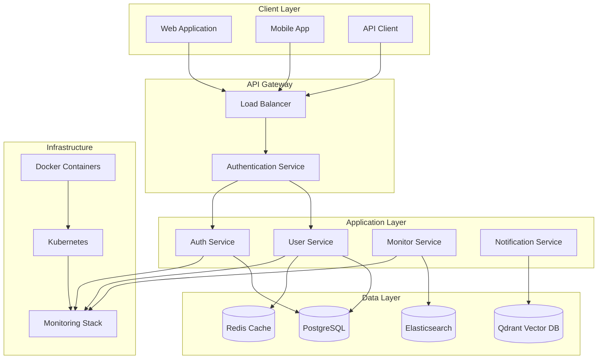

## User Authentication Flow

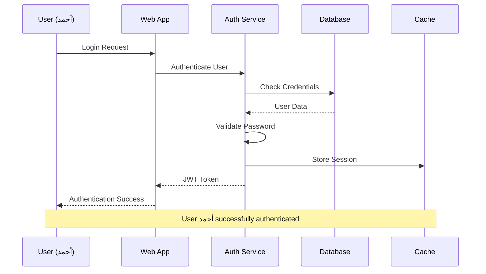

## Database Integration Architecture

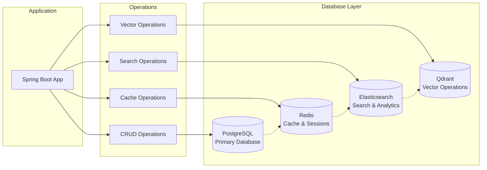

## API Request Flow

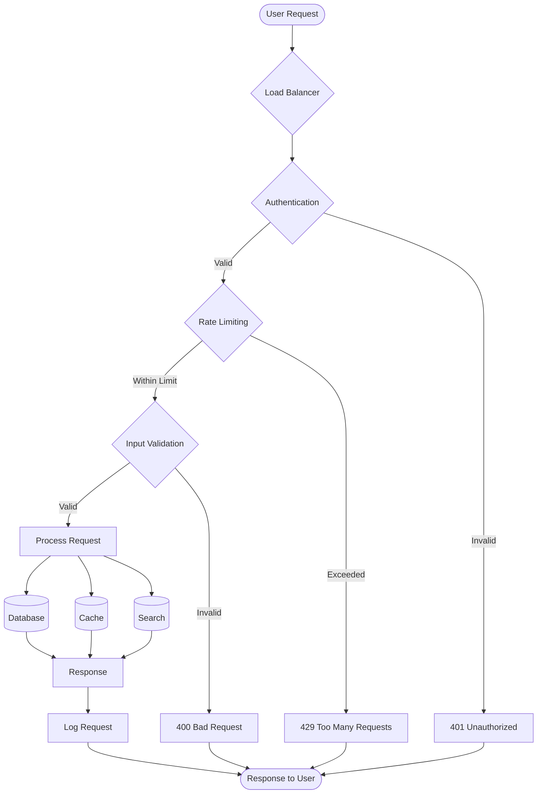

## Microservices Communication

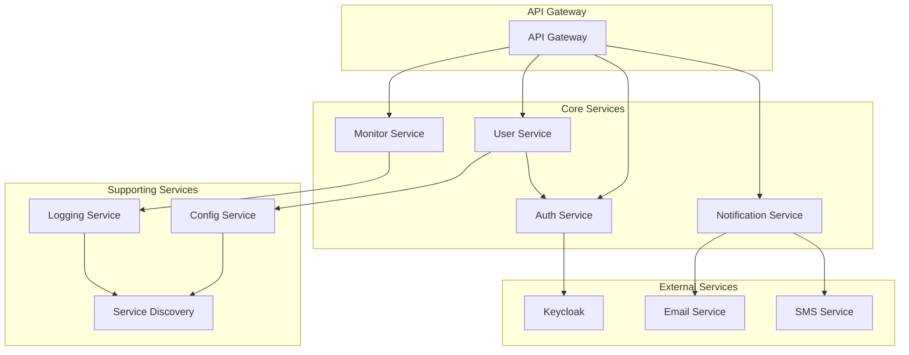

## Data Flow for User Management

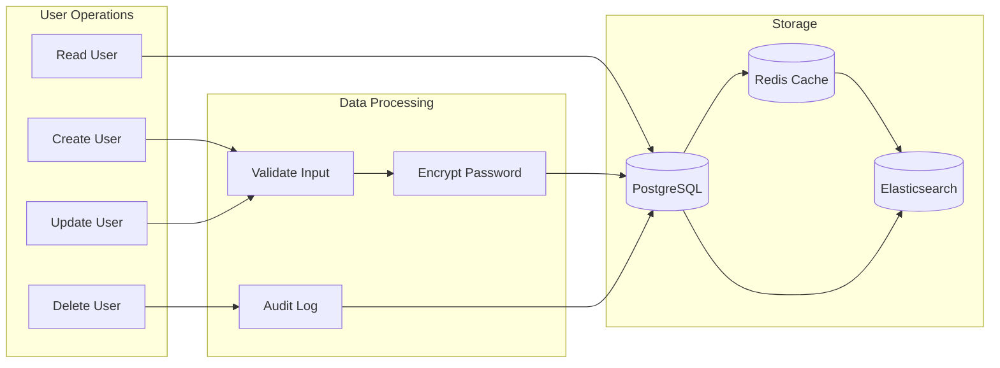

## Security Architecture

```mermaid
graph TB
    subgraph "Security Layers"
        WAF[Web Application Firewall]
        LB[Load Balancer]
        AUTH[Authentication]
        AUTHZ[Authorization]
        VALIDATE[Input Validation]
        ENCRYPT[Encryption]
    end
    
    subgraph "Security Services"
        RATE[Rate Limiting]
        HEADERS[Security Headers]
        LOGGING[Security Logging]
        MONITOR[Security Monitoring]
    end
    
    subgraph "Data Protection"
        PASSWORD[Password Hashing]
        TOKEN[JWT Tokens]
        SESSION[Session Management]
        CACHE[Secure Caching]
    end
    
    WAF --> LB
    LB --> AUTH
    AUTH --> AUTHZ
    AUTHZ --> VALIDATE
    VALIDATE --> ENCRYPT
    
    RATE --> HEADERS
    HEADERS --> LOGGING
    LOGGING --> MONITOR
    
    PASSWORD --> TOKEN
    TOKEN --> SESSION
    SESSION --> CACHE
```

## Deployment Architecture

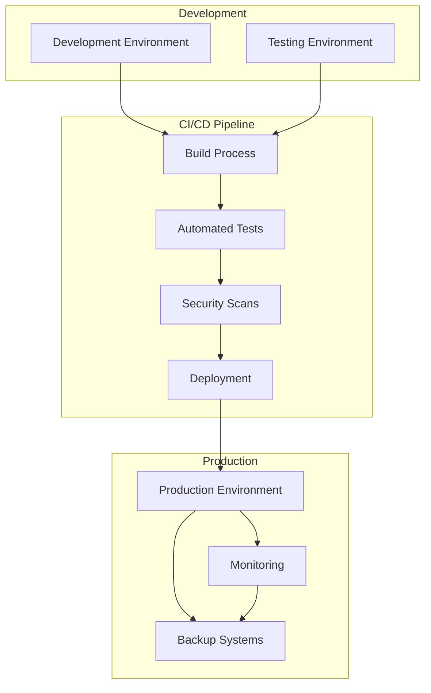

## Monitoring and Observability

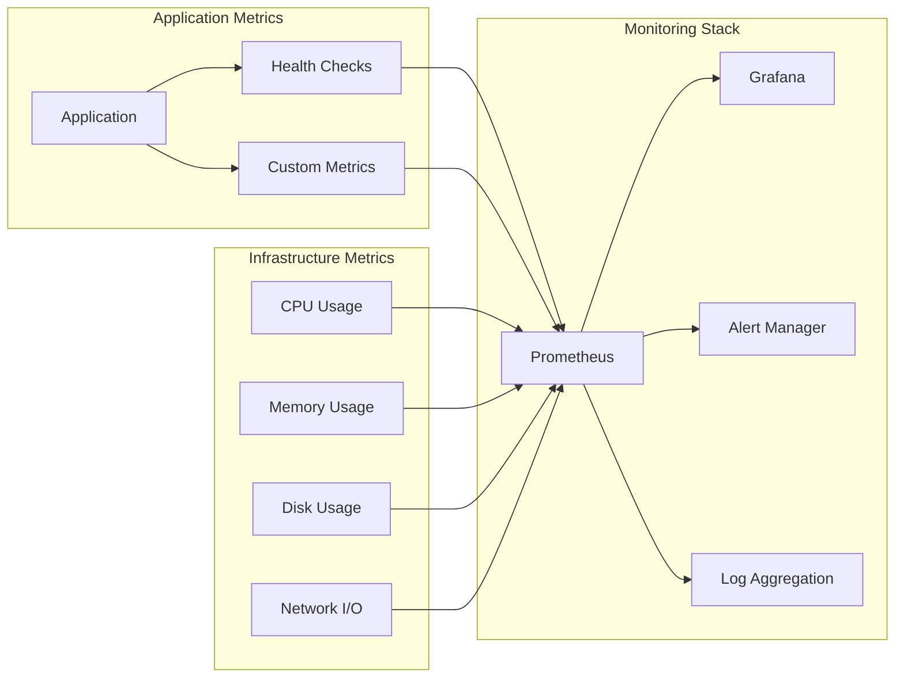

## Database Relationships

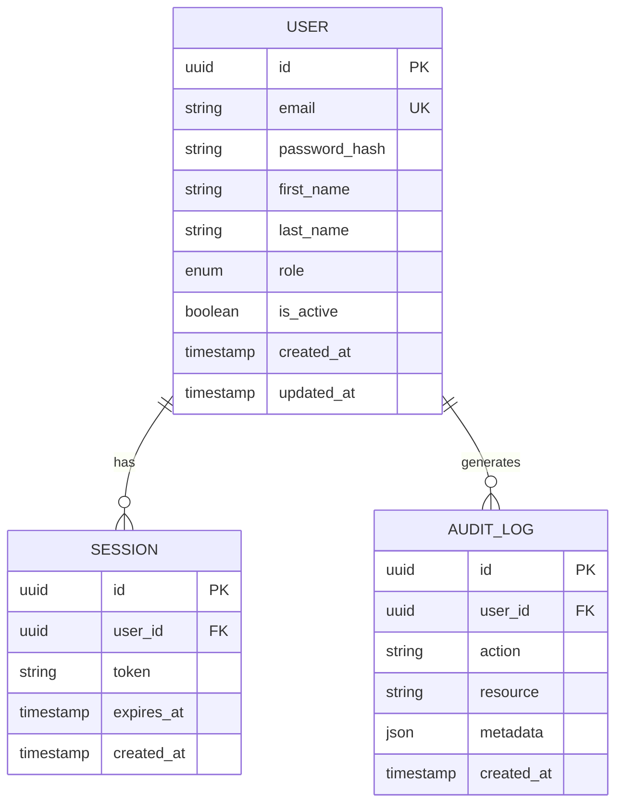

## Component Interaction Diagram

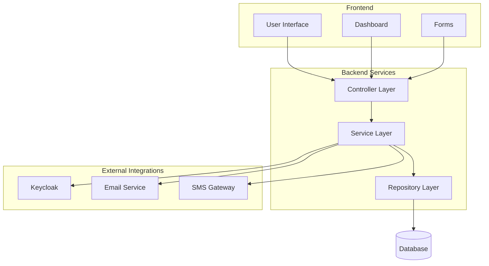

---

## Diagram Usage Guidelines

### When to Use Each Diagram Type

1. **System Architecture** - High-level system overview
2. **Sequence Diagrams** - User interactions and workflows
3. **Flowcharts** - Process flows and decision trees
4. **Entity Relationship** - Database schema relationships
5. **Network Diagrams** - Infrastructure and connectivity

### Best Practices

- **Keep diagrams simple** and focused on key concepts
- **Use consistent colors** and styling
- **Include legends** for complex diagrams
- **Update diagrams** when architecture changes
- **Version control** diagram source files

### Tools for Creating Diagrams

- **Mermaid** - Text-based diagram creation
- **PlantUML** - UML and other diagram types
- **Draw.io** - Visual diagram editor
- **Lucidchart** - Collaborative diagramming
- **Visio** - Microsoft diagramming tool
