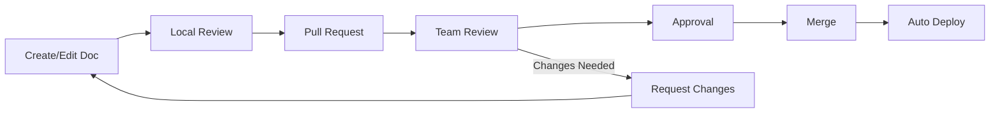
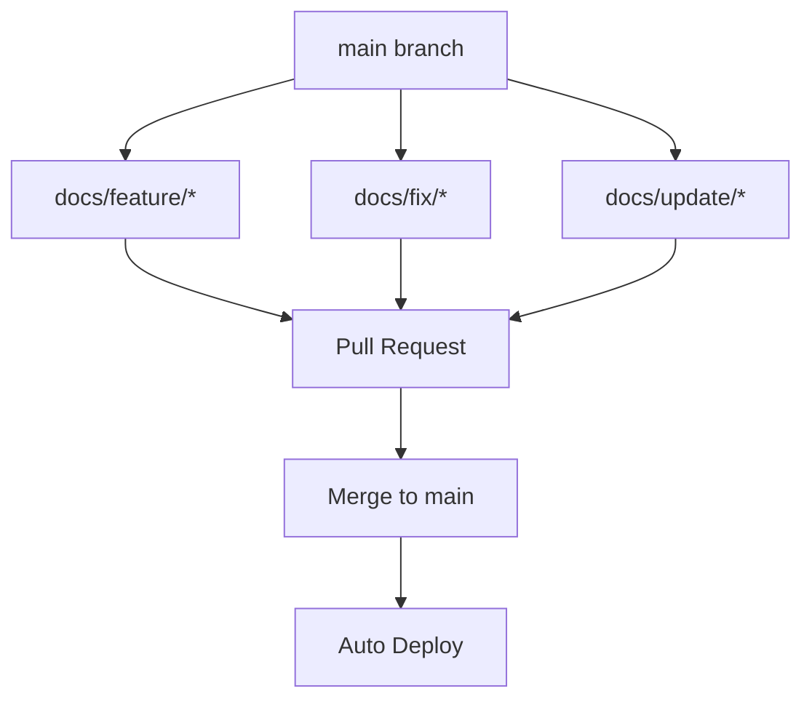
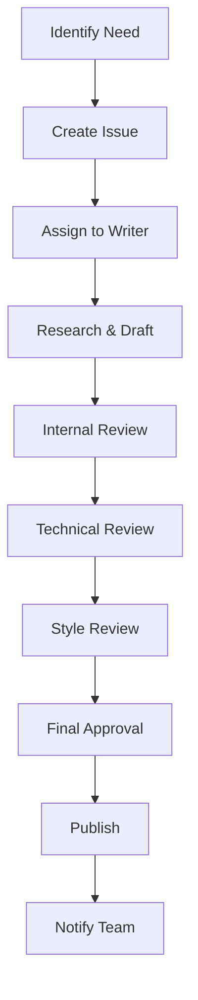
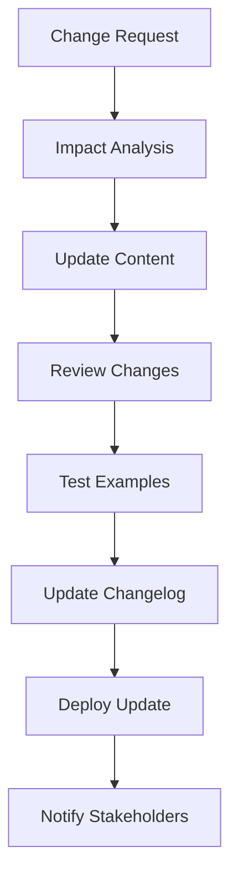
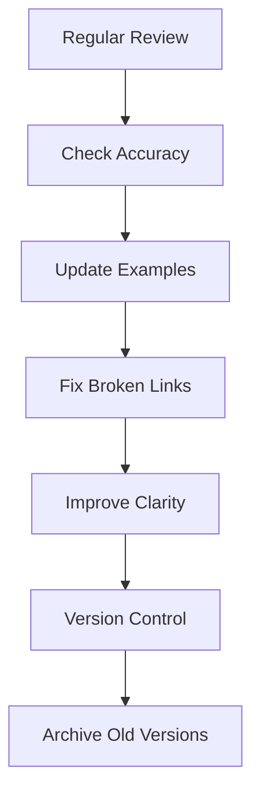
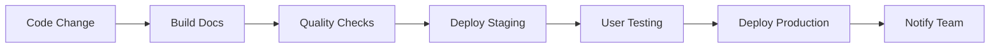

# Collaborative Documentation Workflows

This document outlines the collaborative documentation workflows and best practices for the Smart Deploy Monitor project.

## Team Collaboration Guidelines

### Documentation Roles and Responsibilities

| Role | Responsibilities | Tools |
|------|------------------|-------|
| **Technical Writer** | Content creation, editing, review | Markdown, Git, MkDocs |
| **Developer** | Code documentation, API docs | JavaDoc, Swagger, Git |
| **Product Manager** | Requirements, user guides | Confluence, Notion |
| **QA Engineer** | Testing documentation, procedures | TestRail, Git |
| **DevOps Engineer** | Infrastructure docs, deployment | Git, MkDocs, CI/CD |

### Collaboration Workflow



## Documentation Review Process

### 1. Content Creation
- **Author** creates or updates documentation
- **Self-review** for accuracy and completeness
- **Local testing** of code examples and links

### 2. Peer Review
- **Assign reviewers** based on content type
- **Technical review** for accuracy
- **Style review** for consistency
- **Accessibility review** for usability

### 3. Approval Process
- **Minimum 2 approvals** required
- **No conflicts** with existing documentation
- **All tests passing** (if applicable)

### 4. Publication
- **Automatic deployment** via CI/CD
- **Version control** with Git
- **Change notifications** to team

## Collaborative Tools and Platforms

### Primary Tools

#### Git and GitHub
```bash
# Branch naming convention
git checkout -b docs/feature/user-guide-update
git checkout -b docs/fix/api-documentation-typo
git checkout -b docs/update/architecture-diagrams

# Commit message format
git commit -m "docs: Add user authentication guide"
git commit -m "docs: Fix broken links in API documentation"
git commit -m "docs: Update architecture diagrams"
```

#### MkDocs for Documentation
```yaml
# mkdocs.yml configuration
site_name: Smart Deploy Monitor Documentation
theme:
  name: material
  features:
    - navigation.tabs
    - navigation.sections
    - toc.integrate
    - search.highlight
    - search.share

nav:
  - Home: index.md
  - API Documentation: api/
  - User Guides: guides/
  - Architecture: architecture/
```

### Secondary Tools

#### Notion for Planning
- **Documentation roadmap** and planning
- **Content calendar** and scheduling
- **Team collaboration** and discussions
- **Template library** for consistency

#### Google Docs for Drafting
- **Initial content creation** and brainstorming
- **Collaborative editing** and comments
- **Review and feedback** collection
- **Export to Markdown** for final documentation

## Version Control for Documentation

### Branching Strategy



### File Organization

```
docs/
├── api/                    # API documentation
│   ├── v1/                # API version 1
│   └── v2/                # API version 2
├── guides/                # User guides
│   ├── getting-started/   # Getting started guide
│   ├── installation/     # Installation guide
│   └── troubleshooting/   # Troubleshooting guide
├── architecture/          # System architecture
│   ├── overview.md       # Architecture overview
│   ├── diagrams/         # Architecture diagrams
│   └── decisions/        # Architecture decisions
└── changelog/            # Version history
    ├── v1.0.0.md         # Version 1.0.0 changes
    └── v2.0.0.md         # Version 2.0.0 changes
```

## Content Management Workflows

### 1. New Documentation Creation



### 2. Documentation Updates



### 3. Documentation Maintenance



## Quality Assurance

### Documentation Standards

#### Content Quality
- **Accuracy**: All information is factually correct
- **Completeness**: All necessary information is included
- **Clarity**: Content is easy to understand
- **Consistency**: Style and format are consistent

#### Technical Quality
- **Code Examples**: All code examples are tested and working
- **Links**: All internal and external links are valid
- **Images**: All images are optimized and accessible
- **Formatting**: Consistent markdown formatting

#### Review Checklist

```markdown
## Content Review
- [ ] Information is accurate and up-to-date
- [ ] All examples are tested and working
- [ ] Content is appropriate for target audience
- [ ] All links are working and relevant

## Technical Review
- [ ] Code examples are syntactically correct
- [ ] API endpoints are properly documented
- [ ] Error scenarios are covered
- [ ] Prerequisites are clearly stated

## Style Review
- [ ] Headers are properly formatted
- [ ] Code blocks are properly highlighted
- [ ] Tables are properly formatted
- [ ] Lists are properly indented
```

## Communication and Feedback

### Feedback Collection

#### User Feedback
- **Documentation surveys** after major releases
- **User interviews** for complex topics
- **Analytics tracking** for popular content
- **Support ticket analysis** for pain points

#### Team Feedback
- **Regular retrospectives** on documentation process
- **Peer review feedback** on content quality
- **Tool evaluation** and improvement suggestions
- **Workflow optimization** based on team needs

### Communication Channels

#### Synchronous Communication
- **Daily standups** for documentation updates
- **Weekly documentation reviews** for progress
- **Monthly planning sessions** for roadmap
- **Quarterly retrospectives** for process improvement

#### Asynchronous Communication
- **Slack channels** for documentation discussions
- **GitHub issues** for documentation requests
- **Email notifications** for important updates
- **Wiki pages** for process documentation

## Automation and CI/CD

### Automated Documentation

#### Build Automation
```yaml
# .github/workflows/docs.yml
name: Documentation Build
on:
  push:
    branches: [ main ]
    paths: [ 'docs/**' ]
  pull_request:
    branches: [ main ]
    paths: [ 'docs/**' ]

jobs:
  build:
    runs-on: ubuntu-latest
    steps:
      - uses: actions/checkout@v2
      - name: Setup Python
        uses: actions/setup-python@v2
        with:
          python-version: 3.8
      - name: Install MkDocs
        run: pip install mkdocs mkdocs-material
      - name: Build Documentation
        run: mkdocs build
      - name: Deploy to GitHub Pages
        run: mkdocs gh-deploy
```

#### Quality Checks
```yaml
# Automated quality checks
- name: Check for broken links
  run: |
    pip install markdown-link-check
    find docs -name "*.md" -exec markdown-link-check {} \;
    
- name: Check for spelling errors
  run: |
    pip install pyspelling
    pyspelling -c .spellcheck.yml
    
- name: Check for style issues
  run: |
    pip install markdownlint
    markdownlint docs/**/*.md
```

### Deployment Pipeline



## Best Practices

### Documentation Standards

1. **Consistent Formatting**
   - Use standard markdown formatting
   - Follow established style guide
   - Maintain consistent terminology

2. **Regular Updates**
   - Update documentation with code changes
   - Review and update quarterly
   - Archive outdated content

3. **User-Centric Approach**
   - Write from user perspective
   - Include practical examples
   - Address common use cases

4. **Version Control**
   - Track all documentation changes
   - Maintain version history
   - Tag major releases

### Team Collaboration

1. **Clear Responsibilities**
   - Define roles and responsibilities
   - Establish review processes
   - Set quality standards

2. **Effective Communication**
   - Regular team updates
   - Clear feedback mechanisms
   - Transparent decision making

3. **Continuous Improvement**
   - Regular process reviews
   - Tool evaluation and updates
   - Workflow optimization

---

## Tools and Resources

### Documentation Tools
- **MkDocs**: Static site generator
- **Material for MkDocs**: Modern theme
- **Git**: Version control
- **GitHub**: Collaboration platform

### Quality Tools
- **markdown-link-check**: Link validation
- **pyspelling**: Spell checking
- **markdownlint**: Style checking
- **pre-commit**: Pre-commit hooks

### Collaboration Tools
- **Slack**: Team communication
- **Notion**: Planning and organization
- **Google Docs**: Collaborative editing
- **GitHub Issues**: Task management
