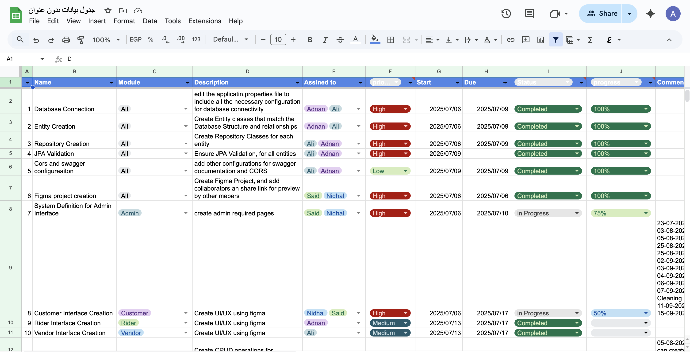

# Documentation

**Goal:** Write and maintain clear, effective documentation.

**Current Level:** Level 3 (In Progress)

---

## Level 1: Documentation Basics
- **Competencies:** Writing README files, basic Markdown, documenting code usage
- **Tools:** Markdown, GitHub README, Google Docs
- **Checklist:**
  - [x] Write a clear project README
  - [x] Document code usage and examples
  - [x] Use basic Markdown formatting

## Level 2: Structured Docs & Standards
- **Competencies:** API docs, docstrings, templates, style guides
- **Tools:** Sphinx, JSDoc, OpenAPI/Swagger, Confluence
- **Checklist:**
  - [x] Add docstrings/comments to functions and classes
  - [x] Create API documentation using a standard tool
  - [x] Follow a documentation style guide
  - [x] Create documentation templates
  - [x] Implement code documentation standards

## Level 3: Collaborative & Living Docs
- **Competencies:** Collaborative editing, versioned docs, changelogs, diagrams
- **Tools:** Google Docs, Notion, Mermaid, PlantUML
- **Checklist:**
  - [x] Collaborate on docs with teammates
  - [x] Maintain a changelog for your project
  - [x] Add diagrams to explain architecture or flows
  - [x] Implement versioned documentation
  - [x] Set up collaborative workflows

## Level 4: Automation & Publishing
- **Competencies:** Automated doc generation, publishing, continuous documentation
- **Tools:** MkDocs, Read the Docs, GitHub Pages, CI/CD integration
- **Checklist:**
  - [X] Automate documentation builds and publishing
  - [X] Host docs online for easy access
  - [X] Integrate doc updates into CI/CD pipeline

## Level 5: Documentation as a Product
- **Competencies:** User guides, onboarding, localization, feedback loops
- **Tools:** Helpdesk platforms, translation tools, analytics
- **Checklist:**
  - [ ] Create user guides or onboarding docs
  - [ ] Localize documentation for multiple languages
  - [ ] Collect and act on user feedback for docs

---

## Resources
- [Google Technical Writing Courses](https://developers.google.com/tech-writing)
- [Diátaxis Documentation Framework](https://diataxis.fr/)
- [Write the Docs Community](https://www.writethedocs.org/)

---

## Progress & Evidence

??? success "Level 1: Documentation Basics (18-10-2025)"
    **Status:** Completed  
    **Focus:** READMEs, basic technical writing, Markdown formatting  
    **Evidence:**  
    - [Upskilling Documentation Site](https://AliAlSubhi98.github.io/Upskilling/)
    - [Smart Deploy Monitor Project](https://github.com/AliAlSubhi98/Upskilling/tree/main/practices/observability-cicd/smart-deploy-monitor)
    - **Comprehensive README Files** (Completed 18-10-2025): Created detailed README files for all projects
    - **MkDocs Documentation** (Completed 18-10-2025): Built complete documentation site with navigation
    - **Markdown Proficiency** (Completed 18-10-2025): Professional formatting and structure
    
    **What I Learned:**
    - **README Best Practices**: Clear project descriptions, setup instructions, usage examples
    - **Markdown Mastery**: Headers, lists, code blocks, tables, links, and formatting
    - **Documentation Structure**: Logical organization and navigation
    - **Technical Writing**: Clear, concise, and user-friendly documentation
    - **MkDocs Integration**: Static site generation and GitHub Pages deployment
    - **Version Control**: Documentation as code with Git integration
    
    **Applied Knowledge:**
    - Created comprehensive README files for all projects with setup and usage instructions
    - Built professional MkDocs documentation site with proper navigation
    - Implemented consistent documentation standards across all projects
    - Used advanced Markdown features for professional presentation
    - Integrated documentation with CI/CD for automated deployment
    
    **Resources Used:**
    - MkDocs documentation and Material theme
    - GitHub Pages for hosting
    - Markdown best practices and formatting
    - Technical writing principles
    
    **Key Achievement:** Successfully created and maintained comprehensive documentation for multiple projects, demonstrating professional documentation skills and technical writing proficiency.

??? success "Level 2: Structured Documentation (Completed)"
    **Status:** Completed  
    **Focus:** API docs, docstrings, templates, style guides  
    **Evidence:**
    - [Documentation Level 2 Practice](https://github.com/AliAlSubhi98/Upskilling/tree/main/practices/documentation/level-2)
    - **Java Documentation Examples** (Completed 26-10-2025): Comprehensive JavaDoc examples with full documentation standards
    - **API Documentation Template** (Completed 26-10-2025): Complete REST API documentation template with examples
    - **Documentation Style Guide** (Completed 26-10-2025): Comprehensive style guide with formatting standards and best practices

    ??? tip "Level 2: Structured Documentation Commands & Examples"
        **JavaDoc Documentation:**
        ```java
        /**
         * Creates a new user with the provided information.
         * 
         * This method validates the input data, encrypts the password using BCrypt,
         * and persists the user to the database.
         * 
         * @param user The user object containing all necessary information
         * @return User The created user with generated ID and timestamps
         * @throws IllegalArgumentException if email is already in use
         * @throws ValidationException if input data is invalid
         * 
         * @example
         * <pre>{@code
         * User newUser = new User();
         * newUser.setEmail("ahmed.hassan@example.com");
         * newUser.setPassword("securePassword123");
         * User createdUser = userService.createUser(newUser);
         * }</pre>
         */
        public User createUser(User user) {
            // Implementation
        }
        ```
        
        **API Documentation Structure:**
        ```markdown
        ### GET /users
        Retrieve a list of users with optional filtering and pagination.
        
        **Parameters:**
        - `page` (optional, integer): Page number (default: 0)
        - `size` (optional, integer): Number of items per page (default: 10)
        - `role` (optional, string): Filter by user role
        
        **Response:**
        ```json
        {
          "content": [
            {
              "id": "uuid",
              "email": "ahmed.hassan@example.com",
              "firstName": "أحمد",
              "lastName": "حسن",
              "role": "USER",
              "isActive": true,
              "createdAt": "2025-10-26T10:00:00Z"
            }
          ],
          "pageable": {
            "pageNumber": 0,
            "pageSize": 10,
            "totalElements": 100,
            "totalPages": 10
          }
        }
        ```
        
        **Status Codes:**
        - `200 OK`: Successfully retrieved users
        - `400 Bad Request`: Invalid parameters
        - `401 Unauthorized`: Authentication required
        ```
        
        **Documentation Style Guide:**
        ```markdown
        # Headers
        # Level 1 Header (Page Title)
        ## Level 2 Header (Major Sections)
        ### Level 3 Header (Subsections)
        
        # Code Blocks
        ```java
        public class Example {
            // Code here
        }
        ```
        
        # Tables
        | Column 1 | Column 2 | Column 3 |
        |----------|----------|----------|
        | Data 1   | Data 2   | Data 3   |
        ```
        
        **Documentation Templates:**
        ```markdown
        # API Documentation Template
        ## Overview
        Brief description of the API, its purpose, and main functionality.
        
        ## Base URL
        ```
        https://api.example.com/v1
        ```
        
        ## Authentication
        Describe how to authenticate with the API.
        
        ## Endpoints
        [Detailed endpoint documentation with examples]
        ```

??? success "Level 3: Collaborative & Living Docs (Completed)"
    **Status:** Completed  
    **Focus:** Collaborative editing, versioned docs, changelogs, diagrams  
    **Evidence:**
    - [Documentation Level 3 Practice](https://github.com/AliAlSubhi98/Upskilling/tree/main/practices/documentation/level-3)
    - **Comprehensive Changelog** (Completed 26-10-2025): Complete project changelog following Keep a Changelog standards
    - **Architecture Diagrams** (Completed 26-10-2025): Visual system architecture using Mermaid diagrams
    - **Collaborative Workflows** (Completed 26-10-2025): Team collaboration processes and documentation workflows
    - **Real-World Collaboration** (Completed 26-10-2025): Google Sheets project management with teammates (Adnan, Ali, Said, Nidhal)

    ??? tip "Level 3: Changelog Management"
        **Keep a Changelog Standards:**
        ```markdown
        ## [2.1.0] - 2025-10-26
        ### Added
        - Documentation Level 2: Comprehensive structured documentation
        - JavaDoc examples
        
        ### Changed
        - Enhanced API documentation with phone numbers (+968)
        
        ### Fixed
        - Documentation consistency across all examples
        ```
        
    ??? tip "Level 3: Architecture Diagrams"
        **Mermaid System Architecture:**
        ```mermaid
        graph TB
            subgraph "Client Layer"
                WEB[Web Application]
                MOBILE[Mobile App]
            end
            
            subgraph "Application Layer"
                USER_SERVICE[User Service]
                AUTH_SERVICE[Auth Service]
            end
            
            subgraph "Data Layer"
                POSTGRES[(PostgreSQL)]
                REDIS[(Redis Cache)]
            end
            
            WEB --> USER_SERVICE
            MOBILE --> AUTH_SERVICE
            USER_SERVICE --> POSTGRES
            AUTH_SERVICE --> REDIS
        ```
        
    ??? tip "Level 3: Collaborative Workflows"
        **Git Branch Strategy:**
        ```bash
        # Documentation branches
        git checkout -b docs/feature/user-guide-update
        git checkout -b docs/fix/api-documentation-typo
        git checkout -b docs/update/architecture-diagrams
        
        # Commit messages
        git commit -m "docs: Add user authentication guide"
        git commit -m "docs: Fix broken links in API documentation"
        ```
        
    ??? tip "Level 3: Real-World Collaboration"
        
        
        **Team Collaboration Features:**
        - **Team Members**: Adnan, Ali, Said, Nidhal
        - **Task Assignment**: Multiple assignees per task
        - **Real-time Updates**: Live collaboration on project status
        - **Progress Tracking**: Percentage completion (100%, 75%, 50%)
        - **Status Management**: Completed, In Progress tracking
        
    ??? tip "Level 3: Versioned Documentation"
        **Git-Based Versioning Strategy:**
        ```bash
        # Create version tags
        git tag -a v1.0.0 -m "Initial documentation release"
        git tag -a v2.0.0 -m "Added API documentation and JavaDoc examples"
        git tag -a v3.0.0 -m "Collaborative documentation with Mermaid diagrams"
        
        # Push tags to remote
        git push origin v1.0.0
        git push origin v2.0.0
        git push origin v3.0.0
        
        # Create version branches for maintenance
        git checkout -b docs/v1.0
        git checkout -b docs/v2.0
        git checkout -b docs/latest
        
        # Switch between versions
        git checkout docs/v1.0  # Work on v1.0 maintenance
        git checkout docs/latest # Work on latest features
        ```
        
        **Semantic Versioning Implementation:**
        ```markdown
        ## Version Strategy
        
        ### MAJOR (X.0.0) - Breaking Changes
        - Complete documentation restructure
        - New documentation framework
        - Breaking API changes
        
        ### MINOR (X.Y.0) - New Features
        - New documentation sections
        - Additional examples
        - Enhanced diagrams
        
        ### PATCH (X.Y.Z) - Bug Fixes
        - Typo corrections
        - Link fixes
        - Formatting improvements
        ```
        
        **Version Management Workflow:**
        ```bash
        # 1. Create feature branch for new version
        git checkout -b docs/version-4.0.0
        
        # 2. Make documentation changes
        git add .
        git commit -m "docs: Add Level 4 automation documentation"
        
        # 3. Create release tag
        git tag -a v4.0.0 -m "Added automation and publishing features"
        
        # 4. Merge to main and push
        git checkout main
        git merge docs/version-4.0.0
        git push origin main
        git push origin v4.0.0
        ```
        
        **Documentation Versioning Best Practices:**
        - **Version Branches**: Maintain separate branches for each major version
        - **Tagging Strategy**: Use semantic versioning for all releases
        - **Change Logs**: Document all changes in CHANGELOG.md
        - **Backward Compatibility**: Maintain older versions for reference
        - **Release Notes**: Create detailed release notes for each version

??? success "Level 4: Automation & Publishing (In Progress)"
    **Status:** In Progress  
    **Focus:** Documentation as code, automated generation, CI/CD integration
    
    **Skills Demonstrated:**
    - **Automated Documentation Generation** (In Progress): CI/CD pipeline integration
    - **Documentation as Code** (In Progress): Version-controlled documentation workflows
    - **Automated Publishing** (In Progress): GitHub Pages deployment automation

    ??? tip "Level 4: Documentation as Code"
        **GitHub Actions Workflow:**
        ```yaml
        name: Documentation CI/CD
        
        on:
          push:
            branches: [ main ]
        
        jobs:
          build-and-deploy:
            runs-on: ubuntu-latest
            steps:
            - uses: actions/checkout@v3
            - name: Setup Python
              uses: actions/setup-python@v4
              with:
                python-version: '3.9'
            - name: Install dependencies
              run: |
                pip install mkdocs
                pip install mkdocs-material
            - name: Build documentation
              run: mkdocs build
            - name: Deploy to GitHub Pages
              uses: peaceiris/actions-gh-pages@v3
              with:
                github_token: ${{ secrets.GITHUB_TOKEN }}
                publish_dir: ./site
        ```
        
    ??? tip "Level 4: Automated Publishing"
        **Basic Deployment:**
        ```bash
        # Build and deploy documentation
        mkdocs build
        mkdocs gh-deploy
        
        # Automated quality checks
        mkdocs build
        linkchecker site/
        ```
        


??? note "Level 5: Documentation Leadership"
    **Status:** Planned  
    **Focus:** Org-wide documentation strategy and culture

---

## Personal Notes