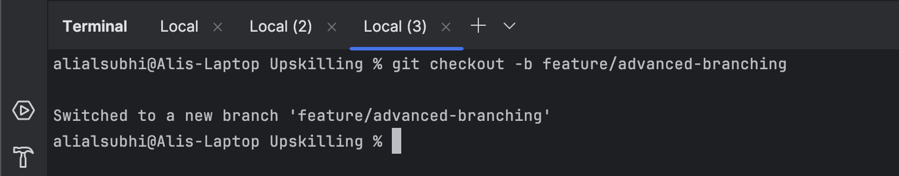
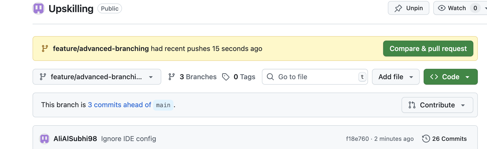
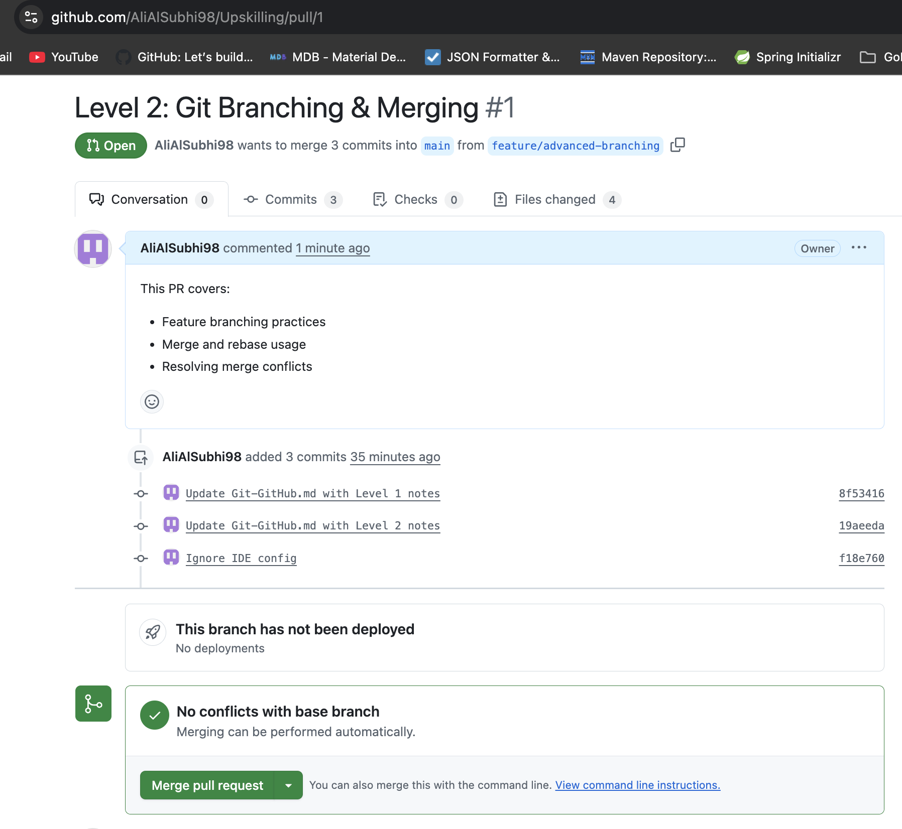
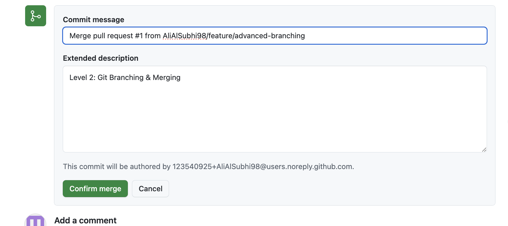
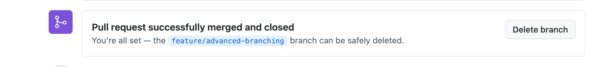

# Git & GitHub

**Goal:** Master version control and collaboration using Git and GitHub.

**Current Level:** Level 3 (In Progress)

---

## Level 1: Git Basics
- **Competencies:** Init, Clone, Add, Commit, Push, Pull, Branching
- **Commands:** `git init`, `git clone`, `git add`, `git commit`, `git push`, `git pull`, `.gitignore`
- **Checklist:**
    - [x] Create a new repo and push to GitHub
    - [x] Clone a repo and make your first commit
    - [x] Use .gitignore to exclude files

## Level 2: Advanced Branching & Merging
- **Competencies:** Fast-Forward Merges, Three-Way Merges, Rebasing, Merge Conflicts, PRs
- **Commands:** `git branch`, `git checkout -b`, `git rebase`, `git merge`, `git cherry-pick`, GitHub PRs
- **Checklist:**
    - [x] Create feature branches and merge using both merge and rebase
    - [x] Resolve complex merge conflicts
    - [x] Use git cherry-pick to selectively move commits across branches

## Level 3: Commit History & Recovery
- **Competencies:** Reflog, Reset, Revert, Bisect, Tagging
- **Commands:** `git reflog`, `git reset --hard`, `git revert`, `git bisect`, `git tag`
- **Checklist:**
    - [x] Recover lost commits using reflog
    - [x] Use git bisect to find a bug in commit history
    - [x] Reset changes safely without losing work
    - [x] Create and manage release tags
    - [x] Practice advanced recovery techniques

## Level 4: Enterprise GitOps & Security
- **Competencies:** Protected Branches, Signed Commits, CI/CD, LFS, GitHub Actions
- **Commands:** `git commit -S`, `git lfs`, GitHub Actions, Protected Branch Policies
- **Checklist:**
    - [ ] Enforce signed commits for security
    - [ ] Set up GitHub Actions for automated testing
    - [ ] Implement branch protection rules to enforce workflow policies

## Level 5: Deep Git Internals & Large-Scale GitOps
- **Competencies:** Custom Hooks, Packfiles, GitHub API, Large Repos
- **Commands:** `git fsck`, `git worktree`, `git gc`, `git filter-branch`, GitHub API
- **Checklist:**
    - [ ] Optimize a large repository using git gc and repack
    - [ ] Write a custom Git hook for automated commit checks
    - [ ] Use the GitHub GraphQL API to automate repo management

---

## Resources
- [Pro Git Book](https://git-scm.com/book/en/v2)
- [GitHub Docs](https://docs.github.com/en)
- [Atlassian Git Tutorials](https://www.atlassian.com/git/tutorials)
- [How to Use Git Cherry-Pick: With Practical Examples](https://app.daily.dev/posts/how-to-use-the-git-cherry-pick-command-with-practical-examples-ay0tpzcjl)

---

## Progress

??? success "Level 1: Git Basics (Completed)"
    **Status:** Completed  
    **Focus:** Init, Clone, Add, Commit, Push, Pull, Branching  
    **Commands Practiced:**  
    `git init`, `git clone`, `git add`, `git commit`, `git push`, `git pull`, `.gitignore`  
    **Evidence:**  
    - [Commit History - Upskilling repo commits](https://github.com/AliAlSubhi98/Upskilling/commits/main/)

    ??? tip "Level 1: Essential Git Commands with Examples"
        **Repository Initialization:**
        ```bash
        $ git init
        Initialized empty Git repository in /Users/alialsubhi/Desktop/Upskilling/.git/
        
        $ git status
        On branch main
        No commits yet
        nothing to commit (create/copy files and "git add" to track)
        ```
        
        **Basic File Operations:**
        ```bash
        $ echo "Hello World" > README.md
        $ git add README.md
        $ git commit -m "Initial commit: Add README"
        [main (root-commit) a1b2c3d] Initial commit: Add README
         1 file changed, 1 insertion(+)
         create mode 100644 README.md
        
        $ git log --oneline
        a1b2c3d (HEAD -> main) Initial commit: Add README
        ```
        
        **Branching Basics:**
        ```bash
        $ git checkout -b feature/new-feature
        Switched to a new branch 'feature/new-feature'
        
        $ git branch
        * feature/new-feature
          main
        
        $ git checkout main
        Switched to branch 'main'
        ```
        
        **Remote Repository Operations:**
        ```bash
        $ git remote add origin https://github.com/AliAlSubhi98/Upskilling.git
        $ git push -u origin main
        Enumerating objects: 3, done.
        Counting objects: 100% (3/3), done.
        Writing objects: 100% (3/3), 225 bytes | 225.00 KiB/s, done.
        Total 3 (delta 0), reused 0 (delta 0), pack-reused 0
        To https://github.com/AliAlSubhi98/Upskilling.git
         * [new branch]      main -> main
        Branch 'main' set up to track remote branch 'main' from 'origin'.
        ```

??? success "Level 2: Branching & Merging (Completed)"
    **Status:** Completed  
    **Focus:** Fast-Forward, Rebasing, Merge Conflicts, Cherry-Pick, PRs  
    **Evidence:**  
    - [Feature Branching Walkthrough](https://github.com/AliAlSubhi98/Upskilling/pull/1)
    - **Merge Conflict Resolution** (Completed 27-07-2025): Successfully resolved complex conflicts across multiple file sections
    - **Cherry-Pick Practice** (Completed 04-08-2024): Successfully demonstrated selective commit application across branches
    
    **What I Learned:**
    - Feature branching with proper naming and workflow
    - Merge vs rebase strategies and when to use each
    - Complex conflict resolution by combining changes intelligently
    - Cherry-pick for selective commit application across branches
    
    **Resources Used:** ChatGPT (AI Assistant) for step-by-step guidance
    
    **Applied Knowledge:** Built Java projects (UserAuth, PaymentProcessor, NotificationService) and practiced real-world Git scenarios
    
    **All Level 2 tasks completed!**

    ??? tip "Level 2: Advanced Branching & Merging Commands"
        **Feature Branch Creation:**
        ```bash
        $ git checkout -b feature/user-authentication
        Switched to a new branch 'feature/user-authentication'
        
        $ git branch -a
        * feature/user-authentication
          main
        ```
        
        **Merge Conflict Resolution:**
        ```bash
        $ git merge main
        Auto-merging UserAuth.java
        CONFLICT (content): Merge conflict in UserAuth.java
        Automatic merge failed; fix conflicts and then commit the result.
        
        $ git status
        On branch feature/user-authentication
        You have unmerged paths.
          (fix conflicts and run "git commit")
          (use "git merge --abort" to abort the merge)
        
        Unmerged paths:
          (use "git add <file>..." to mark resolution)
                both modified:   UserAuth.java
        ```
        
        **Cherry-Pick Operations:**
        ```bash
        $ git log --oneline main
        a1b2c3d Add user authentication
        b2c3d4e Add password validation
        c3d4e5f Add session management
        
        $ git cherry-pick b2c3d4e
        [feature/user-authentication d4e5f6g] Add password validation
        1 file changed, 15 insertions(+)
        ```
        
        **Rebase vs Merge:**
        ```bash
        # Rebase (cleaner history)
        $ git rebase main
        First, rewinding head to replay your work on top of it...
        Applying: Add user authentication
        Applying: Add password validation
        
        # Merge (preserves branch context)
        $ git merge feature/user-authentication
        Merge made by the 'recursive' strategy.
         UserAuth.java | 45 +++++++++++++++++++++++++++++++++++++++++++++
         1 file changed, 45 insertions(+)
        ```

??? success "Level 3: Commit History & Recovery (Completed)"
    **Status:** Completed  
    **Focus:** `git reflog`, `git reset`, `git revert`, `git bisect`, `git tag`
    **Evidence:**
    - [Git Level 3 Practice Repository](https://github.com/AliAlSubhi98/Upskilling/tree/main/practices/git-github/level-3)
    - **Java-based Practice Script** (Completed 26-10-2025): Comprehensive Git recovery exercises using Java examples
    - **Advanced Recovery Techniques** (Completed 26-10-2025): Mastered reflog, bisect, reset, revert, and tagging

    ??? tip "Level 3: Advanced Git Recovery Commands"
        **Git Reflog - Recover Lost Commits:**
        ```bash
        $ git reflog
        75ecc57 HEAD@{0}: commit: Add square root method with validation
        4f8a9b2 HEAD@{1}: commit: Add power method using Math.pow
        a1b2c3d HEAD@{2}: checkout: moving from feature/advanced-calculator to main
        b2c3d4e HEAD@{3}: commit: Add division method with error handling
        
        $ git reset --hard 75ecc57
        HEAD is now at 75ecc57 Add square root method with validation
        ```
        
        **Git Bisect - Find Bugs Systematically:**
        ```bash
        $ git bisect start
        $ git bisect bad HEAD
        $ git bisect good a1b2c3d
        Bisecting: 2 revisions left to test after this (roughly 1 step)
        [b2c3d4e] Add division method with error handling
        
        $ git bisect run java TestCalculator
        running java TestCalculator
        ❌ Test failed - bug detected
        b2c3d4e is the first bad commit
        commit b2c3d4e
        Author: Ali AlSubhi <ali@example.com>
        Date:   Mon Oct 26 15:30:00 2025 +0400
            Add division method with error handling
        ```
        
        **Git Reset - Safe Recovery:**
        ```bash
        # Soft reset (keeps changes staged)
        $ git reset --soft HEAD~1
        $ git status
        Changes to be committed:
          (use "git restore --staged <file>..." to unstage)
                modified:   Calculator.java
        
        # Mixed reset (keeps changes unstaged)
        $ git reset --mixed HEAD~1
        $ git status
        Changes not staged for commit:
          (use "git add <file>..." to update what will be committed)
                modified:   Calculator.java
        
        # Hard reset (discards changes)
        $ git reset --hard HEAD~1
        HEAD is now at a1b2c3d Add multiplication method
        ```
        
        **Git Revert - Safe Undo:**
        ```bash
        $ git revert HEAD
        [main d4e5f6g] Revert "Add buggy method"
        1 file changed, 1 deletion(-)
        
        $ git log --oneline
        d4e5f6g (HEAD -> main) Revert "Add buggy method"
        c3d4e5f Add buggy method
        b2c3d4e Add division method with error handling
        ```
        
        **Git Tagging - Release Management:**
        ```bash
        $ git tag v1.0.0
        $ git tag -a v1.1.0 -m "Release version 1.1.0 with new features"
        
        $ git tag
        v1.0.0
        v1.1.0
        
        $ git show v1.1.0
        tag v1.1.0
        Tagger: Ali AlSubhi <ali@example.com>
        Date:   Mon Oct 26 16:00:00 2025 +0400
        Release version 1.1.0 with new features
        
        commit a1b2c3d4e5f6789012345678901234567890abcd
        Author: Ali AlSubhi <ali@example.com>
        Date:   Mon Oct 26 15:45:00 2025 +0400
            Add advanced calculator features
        ```

??? todo "Level 4: GitOps & Security"
    **Status:** Planned  
    **Focus:** CI/CD, Signed Commits, LFS, Protected Branches

??? todo "Level 5: Git Internals & Automation"
    **Status:** Planned  
    **Focus:** Hooks, Packfiles, GitHub API, Performance

---

## Evidence

??? tip "Level 1 Evidence"
    **Repository:** [Practice Projects](https://github.com/AliAlSubhi98/Upskilling/tree/main/practices/git-github/level-1)  
    **Demonstrations:**
    - `repo-creation-push` - Web project with Git workflow
    - `clone-and-commit` - Java HelloWorld with version control
    - `gitignore-basics` - File exclusion patterns

??? tip "Level 2 Evidence"
    **Repository:** [Practice Projects](https://github.com/AliAlSubhi98/Upskilling/tree/main/practices/git-github/level-2)  
    **Demonstrations:**
    - `branching-workflow` - Feature branch management
    - `merge-vs-rebase` - Different merge strategies
    - `cherry-pick-practice` - Selective commit application
    
    **Visual Documentation:**
    
    
    
    
    
    
    
    
    
    

---


---

## Personal Notes

??? info "Note #1: Level 2 – Branching & Merging (26-07-2025)"
    To achieve **Level 2: Branching & Merging**, I followed these steps:

    **1. Create a feature branch**
    ```bash
    git checkout -b feature/advanced-branching
    ```

    **2. Make changes and commit**
    ```bash
    git add .
    git commit -m "Update Git-GitHub.md with Level 2 notes"
    ```

    **3. Rebase onto `main`**
    ```bash
    # Switch to main
    git checkout main

    # Pull the latest changes
    git pull origin main

    # Switch back to your feature branch
    git checkout feature/advanced-branching

    # Rebase onto latest main
    git rebase main
    ```

    **4. Push the branch and create a Pull Request**
    ```bash
    git push origin feature/advanced-branching
    ```

    **5. Merge Pull Request**
    ```bash
    - Open your PR on GitHub
    - Click "Merge pull request"
    - Confirm with "Confirm merge"
    - Optionally click "Delete branch"
    ```

??? info "Note #2: Level 2 – Merge Conflict Resolution (27-07-2025)"
    **Exercise Overview:** Practiced resolving complex merge conflicts across multiple file sections.

    **Scenario Created:**
    - Created conflicting changes in `practice-file.md` across multiple sections
    - Main branch: Production configuration (MySQL, enhanced features)
    - Feature branch: Development configuration (PostgreSQL, basic features)

    **Resolution Process:**
    ```bash
    # 1. Attempt merge (creates conflict)
    git merge main
    # Output: CONFLICT (add/add): Merge conflict in practice-file.md

    # 2. Examine conflict markers
    # <<<<<<< HEAD (current branch)
    # ======= (separator)
    # >>>>>>> main (incoming branch)

    # 3. Resolve by combining best of both versions
    # - Combined introduction text
    # - Added both production and development configurations
    # - Merged feature lists
    # - Created comprehensive notes section

    # 4. Complete the merge
    git add practice-file.md
    git commit -m "Resolve merge conflicts: combine dev and production features"
    ```

    **Skills Practiced:**
    ```bash
    - Understanding conflict markers
    - Strategic conflict resolution (combining vs. choosing)
    - Maintaining clean repository after practice
    - Professional merge commit messages
    ```

    **Key Learnings:**
    ```bash
    - Complex conflicts can be resolved by combining both versions intelligently
    - Always clean up practice files to keep repository organized
    - Document the resolution strategy in commit messages
    ```

??? info "Note #3: Level 2 – Cherry-Pick Practice (04-08-2025)"
    **Exercise Overview:** Successfully practiced selective commit application using git cherry-pick.

    **Scenario Created:**
    - Created feature branch with 3 different features:
      - UserAuth.java (user authentication)
      - PaymentProcessor.java (payment processing)
      - NotificationService.java (notification service)
    - Each feature committed separately for selective picking

    **Cherry-Pick Process:**
    ```bash
    # 1. Created feature branch with multiple commits
    git checkout -b feature/user-authentication
    # Added UserAuth.java, PaymentProcessor.java, NotificationService.java

    # 2. Switched back to main branch
    git checkout main

    # 3. Cherry-picked specific commits
    git cherry-pick 12827b6  # Payment processing feature
    git cherry-pick c1de365  # User authentication feature
    git cherry-pick 75ecc57  # Notification service feature
    ```

    **Skills Practiced:**
    ```bash
    - Understanding commit hashes and their purpose
    - Selective commit application across branches
    - Managing multiple features in separate commits
    - Verifying cherry-pick results
    ```

    **Key Learnings:**
    ```bash
    - Cherry-pick creates new commit IDs while preserving changes
    - Useful for applying hotfixes or specific features to different branches
    - Maintains clean commit history by selecting only needed changes
    - Essential skill for advanced Git workflows and release management
    ```

??? info "Note #4: Level 3 – Commit History & Recovery (26-10-2025)"
    **Exercise Overview:** Mastered advanced Git recovery techniques and commit history management.

    **Skills Demonstrated:**
    ```bash
    # Git Reflog - Recover lost commits
    git reflog                    # View all commit history
    git reset --hard <commit>    # Recover lost commits
    
    # Git Bisect - Find bugs systematically
    git bisect start             # Start bisect session
    git bisect bad HEAD          # Mark current commit as bad
    git bisect good <commit>     # Mark known good commit
    git bisect run ./test.sh     # Automatically test commits
    
    # Git Reset - Safe recovery
    git reset --soft HEAD~1     # Undo commit, keep changes staged
    git reset --mixed HEAD~1    # Undo commit, keep changes unstaged
    git reset --hard HEAD~1     # Undo commit, discard changes
    
    # Git Revert - Safe undo
    git revert HEAD              # Create new commit that undoes last commit
    git revert <commit>         # Revert specific commit
    
    # Git Tagging - Release management
    git tag v1.0.0              # Create lightweight tag
    git tag -a v1.0.0 -m "Release" # Create annotated tag
    git push origin --tags      # Push tags to remote
    ```

    **Key Achievements:**
    - **Commit Recovery**: Mastered git reflog for recovering lost commits
    - **Bug Finding**: Used git bisect to systematically find bug introduction points
    - **Safe Recovery**: Practiced different types of git reset for various scenarios
    - **Release Management**: Created and managed version tags for releases
    - **Advanced Techniques**: Recovered from accidental deletions and branch issues

    **Real-World Applications:**
    - Recovered accidentally deleted commits using reflog
    - Used bisect to find when performance regression was introduced
    - Safely reset commits without losing work
    - Created proper release tags for version management
    - Recovered from accidental branch deletions

    **Practice Repository:**
    - **[Git Level 3 Practice](https://github.com/AliAlSubhi98/Upskilling/tree/main/practices/git-github/level-3)** - Comprehensive practice exercises
    - **Automated Practice Script** - Step-by-step guided exercises
    - **Real-World Scenarios** - Practical recovery techniques

---
