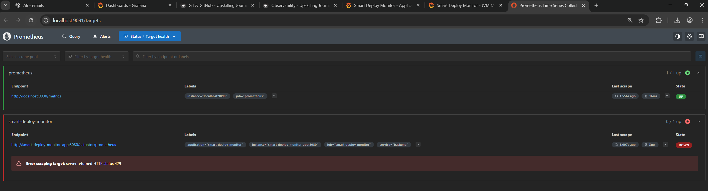
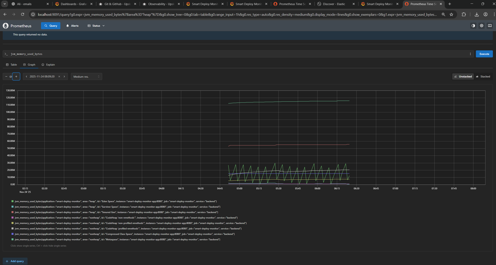
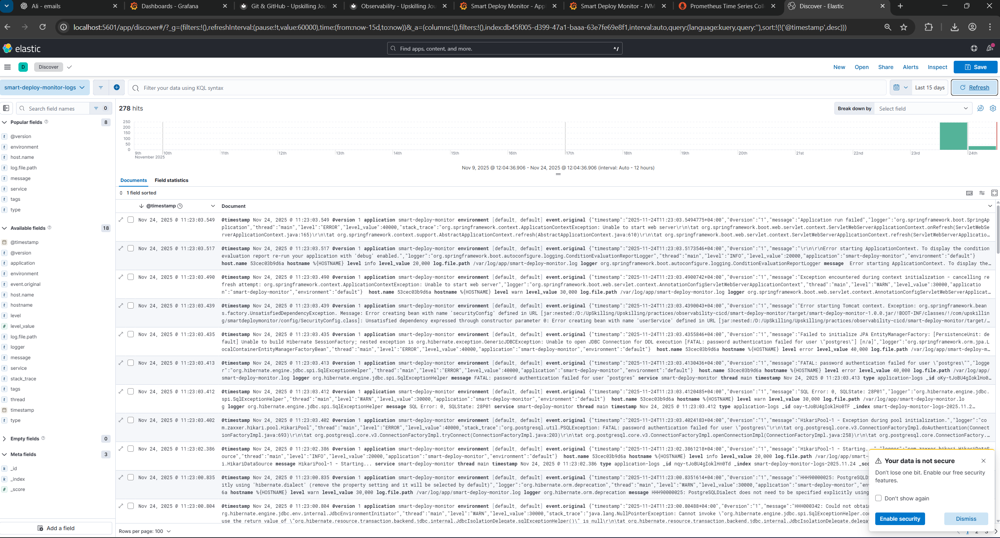
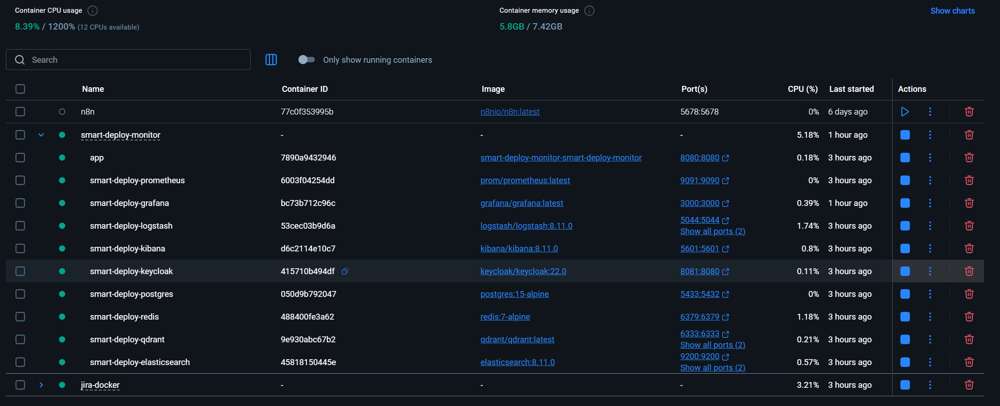

# Observability

**Goal:** Gain complete visibility into system health using logs, metrics, and traces.

**Current Level:** Level 2

---

## Level 1: Monitoring & Logging Basics
- **Competencies:** Log Analysis, Metrics Collection, Understanding Alerts
- **Tools:** Log Files, Syslog, journalctl, top, htop
- **Checklist:**
  - [x] Collect logs from a running application using journalctl or tail -f
  - [x] Use htop or top to monitor real-time system performance
  - [x] Configure basic alerts for server uptime

## Level 2: Advanced Logging & Metrics Collection
- **Competencies:** Centralized Logging, Structured Logs, Metrics Dashboards
- **Tools:** ELK Stack (Elasticsearch, Logstash, Kibana), Prometheus, Fluentd
- **Checklist:**
  - [x] Set up an ELK Stack and aggregate logs from multiple sources
  - [x] Create a Prometheus-based metrics dashboard
  - [x] Implement structured logging with JSON

## Level 3: Distributed Tracing & Centralized Monitoring
- **Competencies:** OpenTelemetry, Jaeger, Log Aggregation, Alerting
- **Tools:** OpenTelemetry (Otel), Jaeger, Grafana, Loki
- **Checklist:**
  - [ ] Integrate Jaeger for distributed tracing in a microservices system
  - [ ] Set up Grafana with Loki for real-time log visualization
  - [ ] Configure log aggregation across multiple services

## Level 4: Full Observability Stack & Incident Response
- **Competencies:** Service Health, Tracing Pipelines, SLA Monitoring
- **Tools:** PagerDuty, Sentry, OpenTracing, Prometheus Alerts, Thanos
- **Checklist:**
  - [ ] Implement a full observability stack with tracing, logs, and metrics
  - [ ] Configure alerts with Prometheus & PagerDuty
  - [ ] Handle a live incident and create a postmortem report

## Level 5: Enterprise Observability & AI-Based Monitoring
- **Competencies:** Machine Learning for Anomaly Detection, Large-Scale Tracing, Automated Infrastructure Health
- **Tools:** AI-Based Anomaly Detection, Kubernetes Observability, Cortex, New Relic, Datadog
- **Checklist:**
  - [ ] Automate log analysis using AI-based anomaly detection
  - [ ] Deploy observability for a large-scale Kubernetes cluster
  - [ ] Implement self-healing infrastructure monitoring

---

## Resources
- [Prometheus Docs](https://prometheus.io/docs/)
- [Grafana Labs](https://grafana.com/)
- [OpenTelemetry](https://opentelemetry.io/)
- [ELK Stack Guide](https://www.elastic.co/what-is/elk-stack)

---

## Progress

??? success "Level 1: Monitoring & Logging Basics (Completed)"
    **Status:** Completed  
    **Focus:** Logging, metrics, application monitoring  
    
    **What I Learned:**
    - **Spring Boot Actuator**: Built-in monitoring endpoints for health checks, metrics, and application info
    - **Micrometer**: Java metrics library for collecting application metrics (Counters, Timers, Gauges)
    - **Structured Logging**: Implemented SLF4J with Logback for consistent log formatting
    - **Custom Metrics**: Created custom metrics for request counting, response times, and system monitoring
    - **Prometheus Integration**: Exposed metrics in Prometheus format for monitoring systems
    - **Scheduled Monitoring**: Used Spring's @Scheduled to collect system metrics every 30 seconds
    
    **Resources Used:**
    - Spring Boot Actuator documentation
    - Micrometer documentation
    - ChatGPT for code examples and troubleshooting
    - Maven for dependency management
    
    **Applied Knowledge:**
    - Built a complete Spring Boot application with observability features
    - Implemented custom metrics collection using Micrometer
    - Created multiple monitoring endpoints for different types of system information
    - Added unit tests to ensure monitoring functionality works correctly
    - Integrated with CI/CD pipeline for automated testing and deployment
    
    **All Level 1 tasks completed!**

??? success "Level 2: Advanced Logging & Metrics Collection (Completed)"
    **Status:** Completed  
    **Focus:** Centralized logging, ELK stack, Prometheus  
    
    **What I Learned:**
    - **ELK Stack**: Set up Elasticsearch, Logstash, and Kibana for centralized log aggregation
    - **Structured JSON Logging**: Configured Logback with logstash-logback-encoder for JSON-formatted logs
    - **Logstash Pipeline**: Created log processing pipeline to parse JSON logs and send to Elasticsearch
    - **Prometheus Integration**: Configured Prometheus to scrape Spring Boot Actuator metrics endpoints
    - **Grafana Dashboards**: Created provisioned dashboards for application metrics and JVM metrics
    - **Docker Compose Orchestration**: Integrated all observability services into docker-compose.yml
    - **Grafana Provisioning**: Configured datasources and dashboards via provisioning files for automation
    
    **Resources Used:**
    - ELK Stack documentation
    - Prometheus configuration guides
    - Grafana dashboard provisioning documentation
    - Logstash pipeline configuration examples
    - Docker Compose networking and volume management
    
    **Applied Knowledge:**
    - Configured Logback with JSON encoder for structured logging
    - Set up Logstash pipeline to process application logs and forward to Elasticsearch
    - Created Prometheus scrape configuration for Spring Boot Actuator endpoints
    - Built Grafana dashboards with PromQL queries for application and JVM metrics
    - Configured Grafana datasource and dashboard provisioning for automated setup
    - Integrated all services with proper health checks and dependencies in Docker Compose
    - Fixed datasource UID references to ensure dashboards display data correctly
    
    **Key Achievement:** Successfully implemented a complete centralized observability stack with ELK for logs, Prometheus for metrics, and Grafana for visualization, enabling full visibility into application health and performance.
    
    **Visual Documentation:**
    
    
    
    
    
    
    
    
    
    
    
    
    
    
    
    **All Level 2 tasks completed!**

??? todo "Level 3: Distributed Tracing & Centralized Monitoring"
    **Status:** Planned  
    **Focus:** Full observability stack, OpenTelemetry, alerting

??? todo "Level 4: Advanced Monitoring"
    **Status:** Planned  
    **Focus:** AI-based monitoring, infrastructure health automation

??? todo "Level 5: Enterprise Observability"
    **Status:** Planned  
    **Focus:** Complete observability strategy across systems

---

## Personal Notes
